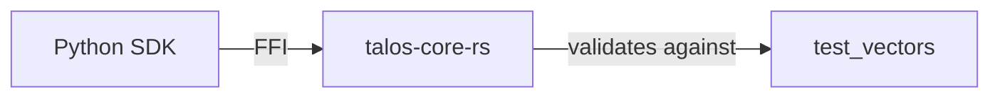

# talos-core-rs Architecture

## Overview
`talos-core-rs` is the high-performance Rust kernel providing cryptographic primitives and validation logic. It is exposed to Python via PyO3.

## Internal Components

| Component | Purpose |
|-----------|---------|
| `src/lib.rs` | PyO3 module entry point |
| `derive_cursor` | Fast cursor derivation (mirrors contracts) |

## External Dependencies

| Dependency | Type | Usage |
|------------|------|-------|
| `[EXTERNAL]` talos-contracts | Test Vectors | Validation against golden data |

## Technology Stack

| Technology | Version | Purpose |
|------------|---------|---------|
| Rust | 1.70+ | Core implementation |
| PyO3 | 0.22 | Python bindings |
| Maturin | - | Build system |

## Boundary Rules
- ✅ Must pass all test vectors from talos-contracts
- ❌ No reimplementation of contract logic (must match exactly)
- ✅ Performance optimizations allowed if semantics preserved

## Data Flow

